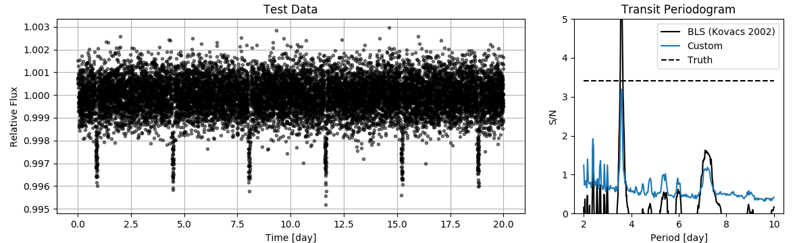

# Exoplanet-Transit-Periodogram
A custom transit periodogram which includes limb darkening effects. A transit model is quickly optimized using a linear least sq approach in order to derive a robust S/N measurement for a range of periods, durations and mid-transit epochs. The robustness of the algorithm is proportional to the computational time however the algorithm returns an estimate for the entire linear orbital ephemeris, P*n + T0. The grid can be discretized for observation specific cadences and durations.

Used in the white paper: https://arxiv.org/abs/1907.03377
